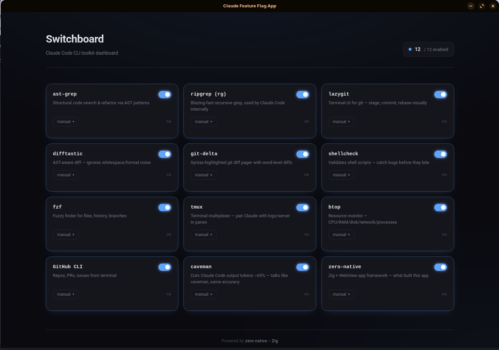

# Switchboard

[](https://github.com/mbergo/claude-code-switchboard/actions/workflows/ci.yml)

Desktop dashboard for Claude Code's CLI toolkit feature flags.



## Stack

Switchboard is built with [zero-native](https://zero-native.dev) — a Zig native host paired with a Next.js frontend rendered in a system WebView. Delivers a single binary for Linux and macOS with no Electron overhead.

## Requirements

- Zig 0.16.0
- Node 20+
- **Linux**: GTK 4 + WebKitGTK 6 (`libgtk-4-dev libwebkitgtk-6.0-dev` on Debian/Ubuntu)
- **macOS**: Xcode command line tools
- zero-native framework at `/home/linuxbrew/.linuxbrew/lib/node_modules/zero-native` (override with `-Dzero-native-path=...`)

## Build & Run

Install dependencies:

```sh
npm install --prefix frontend
```

Development with hot reload:

```sh
zig build dev
```

Production build and launch:

```sh
zig build run
```

Run tests:

```sh
zig build test
```

Package for distribution:

```sh
zig build package
```

Build and version management:

```sh
make build    # bump BUILD, sync to app.zon, rebuild
make run      # dev build + launch
```

Install Linux desktop entry:

```sh
make install
```

Diagnose your setup:

```sh
zero-native doctor --manifest app.zon
```

## Frontend

- Source: `frontend/app/`
- Production export: `frontend/out/`
- Dev server: `http://127.0.0.1:3000/`
- Flag state is persisted to browser localStorage under the key `switchboard.flags`

## Web Engines

Switchboard defaults to the system WebView. You can switch to Chromium/CEF:

```sh
zero-native cef install
zig build run -Dweb-engine=chromium
```

For automated setup with CEF auto-install at build time:

```sh
zig build run -Dweb-engine=chromium -Dcef-auto-install=true
```

Use `-Dcef-dir=/path/to/cef` to specify a custom CEF location.

Verify your web engine setup:

```sh
zero-native doctor --web-engine chromium
```

## Diagnostics

Logs are written to:

```
~/.local/state/dev.zero_native.claude-feature-flag-app/logs/zero-native.jsonl
```

Override the log directory during development:

```sh
export ZERO_NATIVE_LOG_DIR=/custom/path
```

Control log output format:

```sh
export ZERO_NATIVE_LOG_FORMAT=text     # plain text
export ZERO_NATIVE_LOG_FORMAT=jsonl    # JSON lines (default)
```
